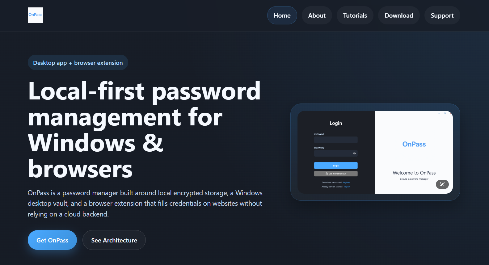

# OnPass - Local-First Password Management

Welcome to the official website repository of OnPass, a local-first password manager built around a Windows desktop vault and a browser extension.

## About OnPass

OnPass is a password manager designed to give users direct control over their credential security. Unlike cloud-based solutions, OnPass keeps sensitive data on the user's device, protects it with encryption, and connects the browser extension to the desktop app through a localhost bridge instead of a remote vault service.

## Website for OnPass

- This repository contains the static website source for the OnPass project
- The site documents the desktop app, browser extension, setup flow, privacy model, and export/import tutorial
- If you want to explore the live site, you can visit: [OnPass website](https://al-khatab.github.io/OnPass-website/index.html)

## Why Choose OnPass?

- **Local-First Storage**: Your vault stays on your machine instead of depending on a cloud backend
- **Desktop + Browser Integration**: The extension connects to the desktop app through authenticated localhost endpoints
- **Reliable Autofill**: The browser extension ranks matching credentials and surfaces them directly on login pages
- **Practical Security**: The project focuses on encrypted storage, explicit trust boundaries, and user-controlled export/import workflows

## Project Components

### [OnPass Desktop](https://github.com/AL-KHATAB/OnPass-Desktop)

The Windows application that stores the encrypted vault, manages login flows, and serves the local API used by the extension.

### [OnPass Extension](https://github.com/AL-KHATAB/OnPass-Extension)

The browser extension that connects to the signed-in desktop app and provides popup search, inline autofill, and domain-aware credential matching.

## Support

- Use the website support page and GitHub repositories for project-related help and issue tracking

